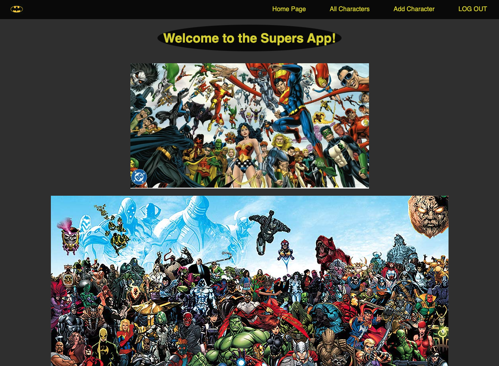
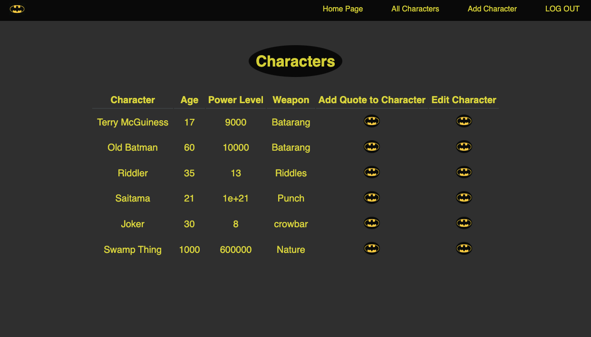
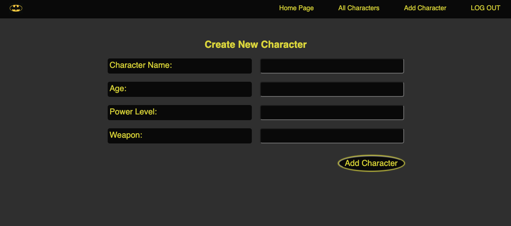
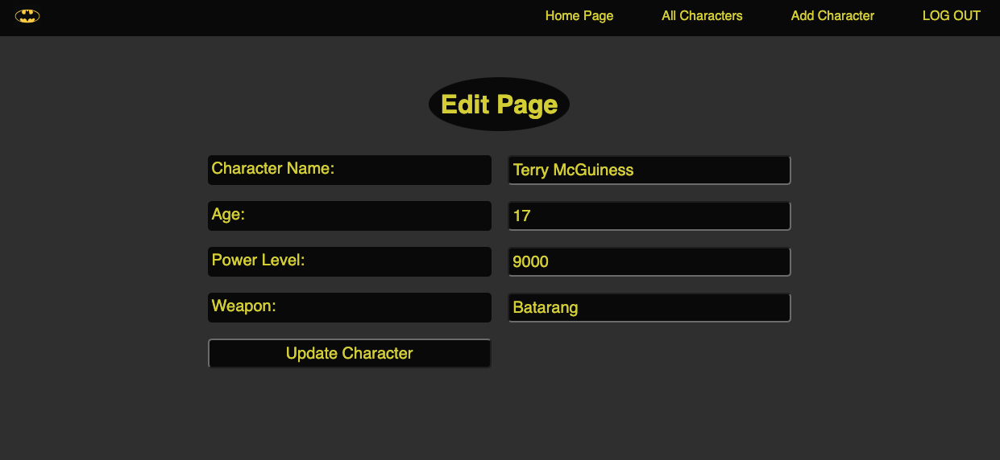

# Supers-App-Project-2

This application is designed to encourage creativity, and have a little fun. Consumers have the ability once logged on to create a character. This character can either be a known individual or a completely original thought. Consumers will have the ability to add the name of the character, their age, power Level, weapon and a special quote. Consumers will also have the ability to update/edit and/or delete certain details tied to the character they've created

## Technologies Used 

HTML, Embedded Javascript (ejs), CSS, Terminal, Trello, Express, Node, MongoDB, Mongoose, VS Code, Git, Mac laptop

## Getting Started
1) Click the following link to get to the game board -> 

2) Once the app is loaded in the browser consumers will need to login to access the functionality of the website. Google Authentication is REQUIRED to use the application

3) Once logged on, consumers will have the ability to create a character however they would like based off the parameters mentioned above - (add the name of the character, their age, power Level, weapon and a special quote)

4) Consumers will also have the ability to edit their already created characters if they wish to change the name or any of the other character parameters. As well as add multiple quotes to each character, and/or delete the quotes they have created for that character

5) Link to trello board to see apps creation flow

## Screenshots

## Next Steps

1) Add delete functionality to a character and not just the quote created for that character

2) Add a dressing room tab so the characters can be given a unique appearance

3) Add a slide show of character examples to the homepage for consumers who may like an idea of what to create before getting started
